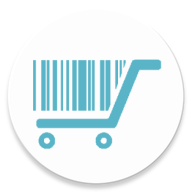

  
  <h1 align="center">FoodBasket</h2>

This work was carried out as part of my final project at the Haute école en Hainaut. It aims to address the various issues related to the management of its food stock and its replenishment.

All food data are provided from the *[Open Food Facts](https://world.openfoodfacts.org)* public database.

## Main features
 
Add your food products to your food stock by scanning them, check their ingredients, nutritional values and set their expiry dates to be notified.

Create your shopping list easily using the product search, set a minimum threshold, transfer your products to your food stock and vice versa.

Share your lists, synchronize and contribute data with an account that can be used by all members of your family.

🌳 Avoid waste and don't forget any more products with FoodBasket! 🌳

## Usage
The application is currently available on the *Google Play Store* [here](https://play.google.com/store/apps/details?id=com.foodbasket).

### *iOS*
At the moment, there is no guarantee that the application will work on *iOS*, I didn't have the opportunity to try it and compile the project on this system.

### *Android*

The file `android/app/google-services.json` is not included because the intention is that you insert your own file to point the code to your own backend.

`$ git clone https://github.com/l-Legacy-l/FoodBasket.git`

`$ cd foodbasket`

`$ react-native run-android`

## Improvements
This project is currently in beta and further improvements are planned.
- Code optimization and project architecture change

- Adding parameters to the application settings

- Compliance with confidentiality rules

- Management of several shopping lists and food stocks

- Addition of various features such as the possibility to group articles by categories, improvements of the UI, language management,...